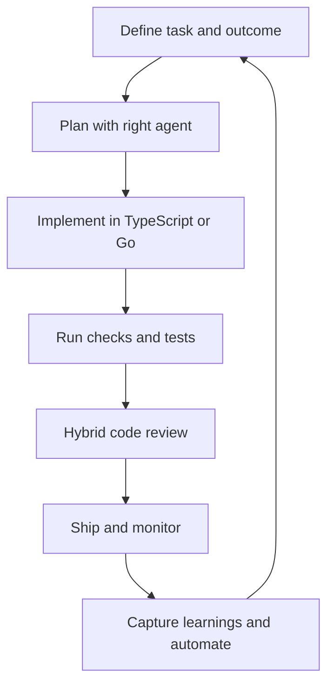

# DotAI

My DotAI files (like dotfiles) provide a preconfigured AI workflow and agent setup for a new machine.
Works on Unix-based systems: macOS, Ubuntu, and WSL.

## Focus on

This AI setup focuses on these pillars:

- Productivity & automation: Build efficient multi-agent workflows and automate routine, low-priority tasks.
- Quality & performance: Deliver high-quality, maintainable code with fast, high-throughput performance.
- Reliability & security: Prioritize stable, dependable, and secure software outcomes.
- Cost efficiency: Reduce cost by optimizing token usage and keeping workflows to as few steps as possible.
- Hybrid Review: Combine human insight with AI-assisted review to validate plans early and review code thoroughly for better outcomes.

## Workflows

### Development Workflow

Workflow for software development agent.



### Research Workflow

Workflow for researcher agent

### Assistant Workflow

Workflow for assistant agent

## Installation

On fresh macOS, install Xcode Command Line Tools (`git` and `make`).

```sh
sudo softwareupdate -i -a
xcode-select --install
```

Option 1: Install with `curl`:

```sh
bash -c "`curl -fsSL https://raw.githubusercontent.com/ntsd/dotai/master/scripts/remote-install.sh`"
```

This clones or downloads the repo to `~/dotai`.

Option 2: Clone manually:

```sh
git clone https://github.com/ntsd/dotai.git ~/dotai
```

Then install everything:

```sh
cd ~/dotai && make
```

## AI Agent

Use multiple AI agents for different purposes.

- opencode: The main AI agent for background tasks and multi-agent workflows.
- GitHub Copilot in VS Code (extension): For hands-on coding, autocompletion, unit test generation, and code reviews.

## Large language models

Only use monthly subscription models to avoid high costs from pay-per-use pricing.

- Gemini (Google One)
- Github Copilot

## Programming Languages

The AI will only generate code in these languages because I am most familiar with them, which helps me review the code more effectively.

- TypeScript: For frontend development (web, mobile, desktop), CLI tools, and Bun backend servers.
- Go: For high-performance, concurrent backend servers and CLI tools.

## Tools

These are CLI and MCP tools we can install to help AI agents take actions, access resources, and maintain context.

### Taskwarrior

A local task management system for syncing progress and context notes between agents. It allows agents to work in parallel and share knowledge while collaborating on related tasks.

### GitHub CLI (gh)

GitHub CLI helps manage GitHub issues, pull requests, and projects. It also enables AI agents to check pull requests and submit reviews.

### Atlassian Command Line Interface (acli)

ACLI supports my company workflows, when available, by enabling read, edit, and create actions for Jira tasks and Confluence pages.

## Project Management

- Jira: Use Jira when the repository provides a Jira link and board.
- GitHub Projects and Issues: Use GitHub Issues and Projects when Jira is not available.

## Conventions

### Git Commits

Git commit messages should follow the [Conventional Commits](https://www.conventionalcommits.org/en/v1.0.0/) format and include issue tracking IDs when applicable.

Examples:

- GitHub issue: `feat(scope): [#999] change something` (where `#999` is a GitHub issue ID)
- Jira issue: `feat(scope): [IN-999] change something` (where `IN-999` is a Jira ID)

## Resrouces

- [A2A Protocal](https://a2a-protocol.org/latest/)
